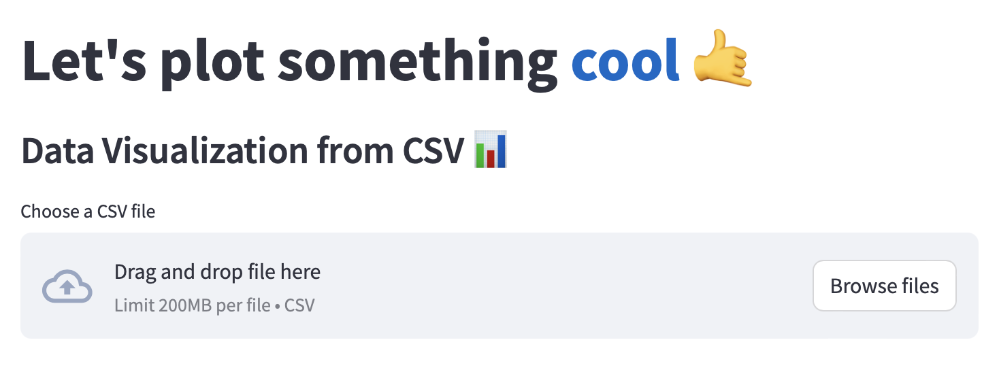
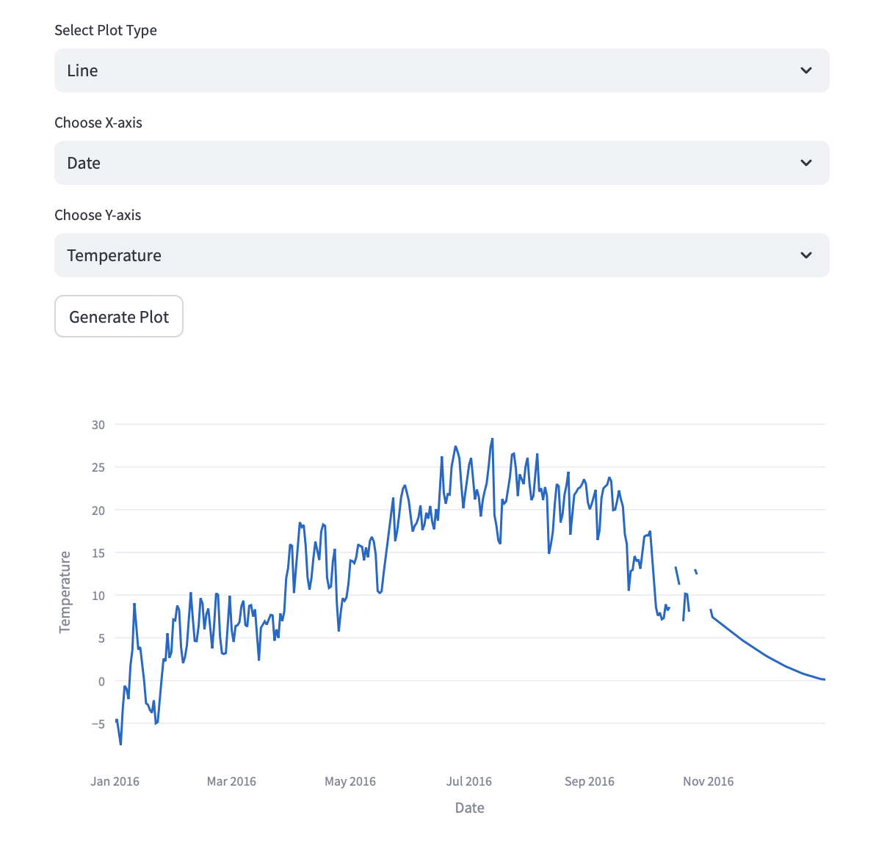

# Data Visualization Tool

This is a basic data visualization tool built with Streamlit. It allows users to upload a CSV file and generate simple line or bar plots by selecting the x and y axes.

## Features

- Upload a CSV file
- Generate line or bar plots
- Choose x and y axes for the plots
- Easy to use with minimal setup

## Getting Started

### Prerequisites

Make sure you have Python installed. You can check this by running:

```bash
python --version
```

## Installation

1. Clone this repository to your local machine:

    ```bash
    git clone https://github.com/ilazan/data-viz-tool.git
    ```

2. Navigate to the project directory:

    ```bash
    cd data-viz-tool
    ```

3. Install the required Python packages:

    ```bash
    pip install -r requirements.txt
    ```

   If there is no `requirements.txt` file, you can manually install Streamlit:

    ```bash
    pip install streamlit
    ```

### Running the App

To run the Streamlit app, use the following command in your terminal:
```bash
streamlit run /path/to/your/directory/data_viz_tool.py
```

For example, if you're in the project directory, you can run:
```bash
streamlit run data_viz_tool.py
```
Once the command is executed, Streamlit will start a local server. You can access the app in your web browser at [http://localhost:8501](http://localhost:8501).

## Usage

1. Open the app in your browser.
2. Upload a CSV file using the provided upload button.
3. Select the x and y axes from the dropdown menus.
4. Choose between generating a line plot or a bar plot.
5. The app will display the plot based on your selections.

## Example CSV File

An example CSV file is included in this repository to help you get started. You can find it in the project directory as `weatherHistory.csv`. To try it out:

1. Run the app as described above.
2. When prompted to upload a file, select `weatherHistory.csv` from the project directory.
3. Choose the x and y axes for your plot.
4. Select whether you want a line or bar plot, and view the generated visualization.

## Screenshots

Here's how the app interface looks:

**File Upload Section:**



**Generated Line Plot:**



## Contributing

Contributions are welcome! Feel free to open an issue or submit a pull request.

## License

This project is licensed under the MIT License - see the [LICENSE](LICENSE) file for details.

